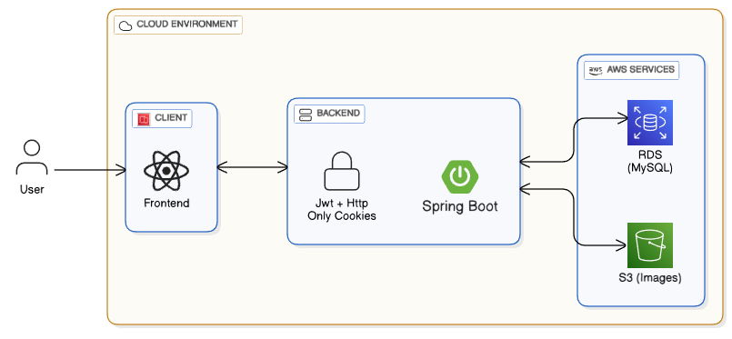

# Krushak Sanyog – Frontend (React)

> 

> 

Krushak Sanyog is a map-based discovery platform that helps people explore nearby farmers and the fresh produce they grow.  
This is **not** an e-commerce platform — there is no online ordering, payment, or delivery system.  
Instead, it acts as a **local discovery tool**, enabling buyers to find farmers, browse products, view maps, and save items using wishlist features.

This repository contains the **frontend client**, built using **React + Create React App**, with features like product exploration, filtering, location-based search, map view, image optimization, and authentication flows.

> 

> Backend: https://github.com/anurag-tarai/krushak-sanyog-backend

---

## 1. Application Overview

The frontend interacts with the backend APIs to provide:

- Product explore page with filters & category search  
- Map-based farmer discovery using **Leaflet / Google Maps**  
- Location-based filtering (current location & manual select)  
- Wishlist features (add/remove items)  
- Secure auth flow (login, register)  
- Lazy-loaded images and optimized asset delivery  
- Responsive UI styled with **TailwindCSS**  
- Animations using **Framer Motion**

---

## 2. Tech Stack

### **Core**
- React 18 (Create React App)
- React Router v6
- TanStack React Query
- Axios

### **UI / Styling**
- TailwindCSS
- Framer Motion
- React Toastify

### **Maps**
- React Leaflet + Leaflet  
- (Optionally) @react-google-maps/api

### **Utilities**
- browser-image-compression  
- react-lazy-load-image-component  

---

## 3.System Architecture Overview

> 

---

## 12. Future Enhancements

- Improved user profile and settings  
- Farmer profile exploration  
- Enhanced map experience with clustering  
- Accessible UI components  
- Icon library consolidation  
- Performance optimizations and code splitting  

---

## 13. License

This project is licensed under the MIT License — see the [LICENSE](LICENSE) file for details.

---
